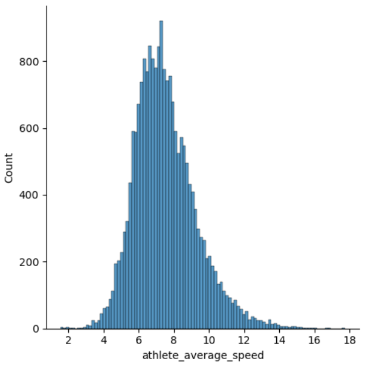
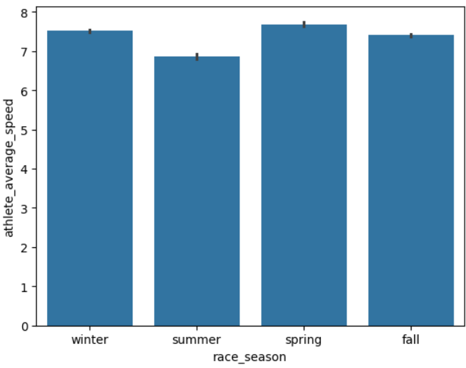
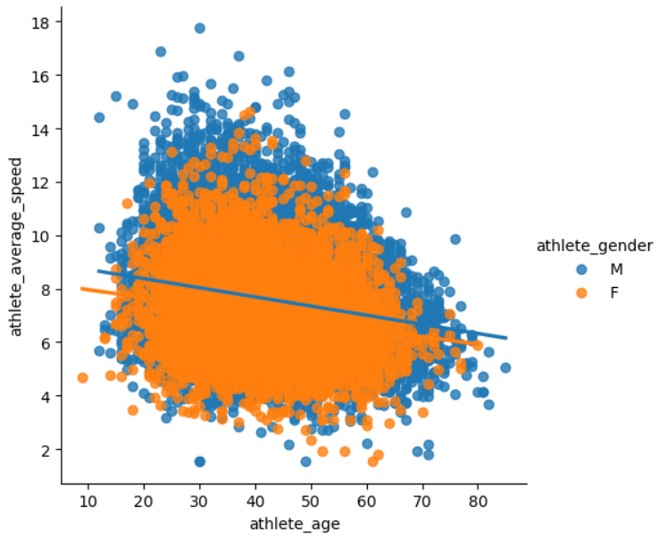

# 🏃‍♂️ Exploratory Data Analysis on Athlete Performance Data
 
**Tools**: Python, Pandas, Seaborn, Jupyter

---

## 📌 Project Overview

This project performs exploratory data analysis (EDA) on a dataset containing athlete race statistics — such as average speed, race times, and seasonal performance — to uncover trends and potential performance patterns.

The goal is to derive **insights from raw data** using **data cleaning, aggregation, and visualization techniques**. The project showcases my ability to work with real-world, imperfect data and communicate results visually.

---

## 🧠 Objectives

- Identify trends in athlete performance across race seasons.
- Visualize average speeds and outlier distributions.
- Apply grouping and aggregation to reveal summary statistics.
- Practice professional-grade EDA workflows in Jupyter.

---

## 🛠️ Tools & Technologies

| Tool | Purpose |
|------|---------|
| `Python` | Data manipulation & scripting |
| `Pandas` | Data cleaning & aggregation |
| `Seaborn` | Statistical data visualization |
| `Matplotlib` | Plot customization |
| `Jupyter Notebook` | Interactive exploration |

---

## 🗃️ Dataset Source

This project uses data from **Kaggle: The Big Dataset of Ultra Marathon Running**.

- 📂 Dataset: [The Big Dataset of Ultra Marathon Running](https://www.kaggle.com/datasets/aiaiaidavid/the-big-dataset-of-ultra-marathon-running)
- 📎 Author: [David E. Aiello](https://www.kaggle.com/aiaiaidavid)
- 📝 License: [CC BY-SA 4.0](https://creativecommons.org/licenses/by-sa/4.0/)

> The dataset contains comprehensive information on ultra marathon athletes, races, distances, and average speeds. For more details, visit the original dataset page.


## 📊 Key Insights

- Race seasons show **clear variation in average speed**, which may reflect seasonal conditions or training cycles.
- **Outliers and skewness** are present and require attention before any modeling.
- Data required **column normalization** and renaming to support correct analysis.

---

## 📸 Visual Highlights

Below are a few visualizations from the analysis:

### 🔹 Distribution of Athlete Speeds


---

### 🔹 Speed by Race Season (Boxplot)


---

### 🔹 Trend of Average Speed Over Time


---


## 🚀 How to Run

1. **Clone this repo**:
```
git clone https://github.com/your-username/eda-athlete-performance.git
cd eda-athlete-performance
```
2.**Install dependencies**:
```
pip install -r requirements.txt
```
3.**Open the Jupyter notebook**:
```
jupyter notebook eda_athlete_performance.ipynb
